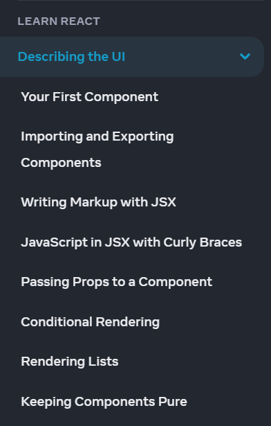
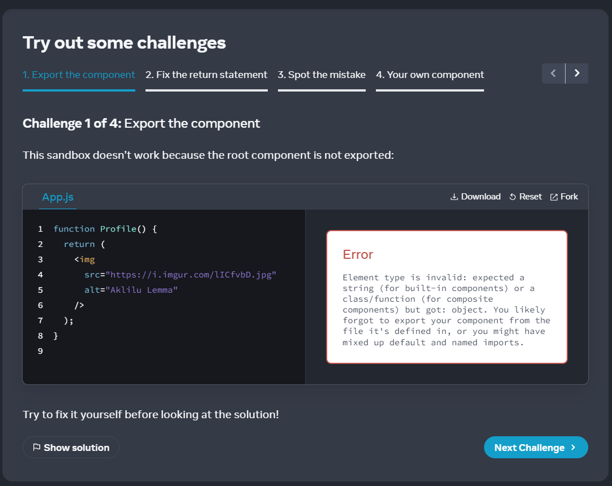
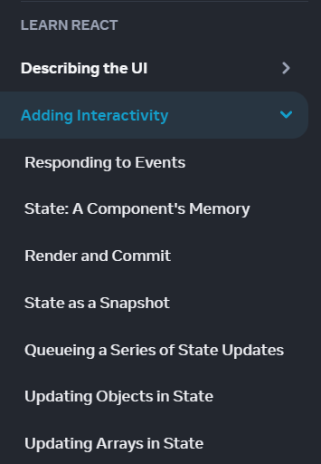

# Master ReactJS by Building Projects

⚛️ In batch 2, we'll take a deep dive into the world of ReactJS! We'll start with the fundamentals and move on to more advanced concepts like API calls, Hooks, and higher order components.

💻 You'll get plenty of hands-on practice with 50+ assignments, including ones that companies give during their interview process.

🌟 In addition to ReactJS, we'll also cover other advanced concepts like React Router, Tailwind CSS, Material UI, Redux, TypeScript, and NextJS.

🎨 And of course, we'll build five fully functional real-world projects!

👨‍💼 Plus, our top performer will get a chance to have a mock interview and a recommendation from me.

  

## **NOTE:**

It's important to have a solid foundation in JavaScript before diving into React. Make sure you have a good understanding of variables, data types, functions, arrays, objects, loops, and conditional statements.

If you are not sure you should choose batch 1 or batch 2. I would advise you to finish google keep clone or GitHub wrapper assignment mentioned in batch 1. If you are able to complete that, then you should choose batch 2. Otherwise learn HTML, CSS, and JavaScript while solving 20+ assignment.

[Batch 1 Details](https://www.notion.so/Frontend-Developer-Essential-Course-209fe03307eb484bb49ea6134dac4266)

[Assignment Link](https://www.notion.so/Mastering-the-JavaScript-Language-From-Basics-to-Advanced-afc1f82af2454d4492ff96cec939aaeb)

[Submit Your Assignment In This Form](https://docs.google.com/forms/d/e/1FAIpQLScXfNlUz2a0XkZJ7uDOG4yEKwMi1QmrYW7wxWj0KPH8sAP76Q/viewform)

**If you submitted the assignment, then you will get a link of WhatsApp community for asking your doubts and learning with a community.
Also you will get a google sheet link, where you have to submit your assignment, so that We can track your progress.**

## Learn Fundamentals of ReactJS and Build Counter App

🎥 In this video, we cover the fundamental concepts of ReactJS, including:

- Components 🧩: the building blocks of a React application
- Functional vs Class Components 🏗️: the two types of components in React and their differences
- Named and Default Import/Export 📡📦: how to import and export components in React
- JSX 💻: a syntax extension for JavaScript that allows us to write HTML-like code in our JavaScript
- Props 🎁: how to pass data from a parent component to a child component
- Default Props 🏷️🎁: how to set default values for props
- State 📊: a way to manage data within a component
- Creating a Counter App 🔢: a hands-on example to demonstrate the concepts we covered
- Questions to Solve ❓: some practice questions to test your understanding of the material
- Simple Task 🤏: a hands-on exercise to reinforce your learning

🚀 By the end of this video, you'll have a solid understanding of the fundamentals of ReactJS and be ready to start building your own React applications.

  

### Task 1:

1. Add a reset button that resets the counter back to zero
2. Add a feature that allows the user to increment/decrement the counter by a custom value (e.g., 5 or 10)
3. Add a feature that allows the user to change the color of the counter based on its value (e.g., green for positive values, red for negative values).
4. Design your first app, and share the code sandbox link in google sheet for tracking your progress.
5. 🚀 Don't forget to share your learning and assignments on LinkedIn and Twitter using **#FrontendWithVishal** to showcase your skills to potential employers!

### Task 2:

1. Let's head over to the official documentation of ReactJS and read the Describing the UI section in its entirety. We covered these topics in the previous video, but developing the habit of reading documentation is essential to becoming a skilled developer. 📖🤓

    

 

2. At the end of each article, you'll find a few challenges to tackle. These challenges will help solidify your understanding of the concepts and make it easier to remember the code syntax. There are a total of 22 challenges spread across 8 articles. 🧐💻

    

 

3. How do you feel after completing these challenges? Did reading the official ReactJS documentation make it easier to understand the technology? Share your experiences and learning journey on LinkedIn and Twitter using the hashtag #FrontendWithVishal to inspire others to learn from the official documentation too. 🤝🚀

### Task 3:

1. Did you understand how ReactJS renders components? Take a moment to explain the concepts of **Triggering** a render, **Rendering** the component, and **Committing** to the DOM in a LinkedIn post or Twitter thread with a helpful image. Don't forget to use the hashtag #frontendwithVishal. 
    
**NOTE:** Understanding how React components render will help you grasp advanced topics in ReactJS and make debugging your code much easier. So, this task is a must-do! 🤔👨‍💻

## Continue Fundamentals of ReactJS and Build Todo App

- Preview of Todo App 📝
- Setting up the Coding Environment 💻
- List Rendering 📋
- Adding a Task ➕
- Deleting a Task ❌
- Conditional Rendering 🤔
- Marking a Task as Complete ✅
- Adding Task Filters 🔍
- Clearing All Completed Tasks 🗑️
- Showing Remaining Tasks Count 🔢
- Refactoring APP into a Component 🔄
- Understanding Fragment in React 🧩
- Organizing all Components in the Components Folder 📁
- How to Submit the Assignment? 📩

  

### Task 4:

1. Add, Delete and Mark as Complete the Task
2. Filter Active and Completed Task
3. Store Tasks in local storage, so that tasks doesn’t disappear on refreshing.
4. **(Optional)** Implement Drag and Drop Task feature, you can use react-beautiful-dnd npm package. Refer [https://www.npmjs.com/package/react-beautiful-dnd](https://www.npmjs.com/package/react-beautiful-dnd)
5. Design the website as illustrated in the video
6. Add Both light and dark theme
7. 🚀 Don't forget to share your learning and assignments on LinkedIn and Twitter using **#FrontendWithVishal** to showcase your skills to potential employers!

### Task 5:

1. Let's head over to the official documentation of ReactJS and read the Describing the UI section in its entirety. We covered these topics in the previous video, but developing the habit of reading documentation is essential to becoming a skilled developer. 📖🤓

    

    
2. At the end of each article, you'll find a few challenges to tackle. These challenges will help solidify your understanding of the concepts and make it easier to remember the code syntax. There are a total of 22 challenges spread across 8 articles. 🧐💻
3. How do you feel after completing these challenges? Did reading the official ReactJS documentation make it easier to understand the technology? Share your experiences and learning journey on LinkedIn and Twitter using the hashtag #FrontendWithVishal to inspire others to learn from the official documentation too. 🤝🚀

## Assignment 3: Build a Time Bound Question / Answer Web App

  

### Task 6:

1. Build a time-bound question-answer web app using ReactJS.
2. Add a timer that stops when the time runs out and displays the user's score.
3. Include a review answer section where users can go back and check their answers.
4. Ensure the web app has an aesthetically pleasing design.
5. 🚀 Don't forget to share your learning and assignments on LinkedIn and Twitter using **#FrontendWithVishal** to showcase your skills to potential employers!

### Note:

It is self paced course, so you can finished the assignments according to your time. But, I highly suggest to finish the assignment within 2-3 days, so that you can move to next assignment and finish this course fast and move to batch 3.
